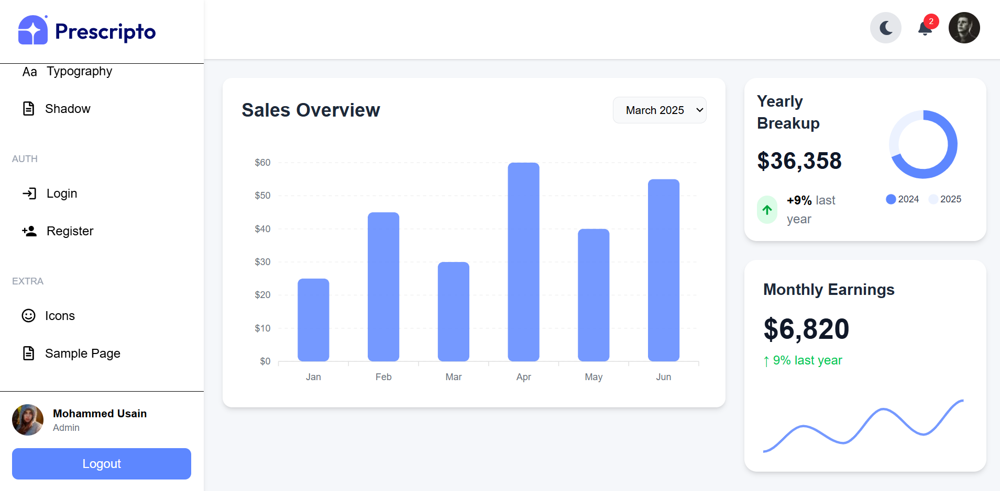

# 🚀 Prescripto Admin Dashboard

A modern and responsive Admin Dashboard built using React and Tailwind CSS.

---

## ✨ Features

- 🌙 Dark Mode
- 📊 Interactive Apex Charts
- 👤 Profile Page
- 🔐 Login & Register UI
- 🛡 Protected Routes
- 📱 Fully Responsive Design
- 🔔 Notification System
- 🎨 Modern UI

---

## 🛠 Tech Stack

- React.js
- Tailwind CSS
- React Router DOM
- React Icons
- ApexCharts
- React Toastify
- Context API

---

## 📸 Screenshots

### Dashboard (Light Mode)



---

### Dashboard (Dark Mode)


---

### Login Page


---

## 📦 Installation

```bash
npm install
npm run dev
```

---

## 📂 Project Structure

```text
src/
 ├── assets/
 ├── components/
 ├── context/
 ├── pages/
 ├── App.jsx
 └── main.jsx
```

---

## 👨‍💻 Author

**Mohammed Usain**
